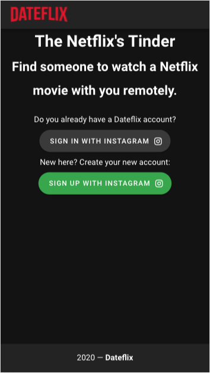
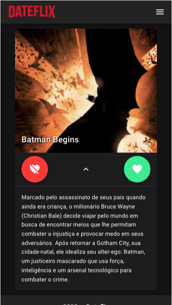

<!--
*** Thanks for checking out this README Template. If you have a suggestion that would
*** make this better, please fork the repo and create a pull request or simply open
*** an issue with the tag "enhancement".
*** Thanks again! Now go create something AMAZING! :D
-->

<!-- PROJECT SHIELDS -->
<!--
*** I'm using markdown "reference style" links for readability.
*** Reference links are enclosed in brackets [ ] instead of parentheses ( ).
*** See the bottom of this document for the declaration of the reference variables
*** for contributors-url, forks-url, etc. This is an optional, concise syntax you may use.
*** https://www.markdownguide.org/basic-syntax/#reference-style-links
-->

<!-- [![Contributors][contributors-shield]][contributors-url]
[![Forks][forks-shield]][forks-url]
[![Stargazers][stars-shield]][stars-url]
[![Issues][issues-shield]][issues-url]
[![MIT License][license-shield]][license-url]
[![LinkedIn][linkedin-shield]][linkedin-url] -->

<!-- PROJECT LOGO -->
<br />
<p align="center">
  <a href="https://dateflix.netlify.app/">
    
  </a>

  <h3 align="center">Dateflix API</h3>

  <p align="center">
    The API for Dateflix APP, the Tinder for Netflix
    <!-- <br /> -->
    <!-- <a href="https://github.com/othneildrew/Best-README-Template"><strong>Explore the docs »</strong></a> -->
    <br />
    <br />
    <a href="https://www.getpostman.com/collections/2fa7017a38f30cc4ba55">Postman Collection</a>
    ·
    <a href="https://github.com/pythrick/dateflix-api/issues">Report Bug</a>
    ·
    <a href="https://github.com/pythrick/dateflix-api/issues">Request Feature</a>
  </p>
</p>

<!-- TABLE OF CONTENTS -->

## Table of Contents

- [About the Project](#about-the-project)
  - [Built With](#built-with)
- [Getting Started](#getting-started)
  - [Prerequisites](#prerequisites)
  - [Installation](#installation)
- [Usage](#usage)
- [Roadmap](#roadmap)
- [Contributing](#contributing)
- [License](#license)
- [Contact](#contact)

<!-- ABOUT THE PROJECT -->

## About The Project

<p align="center">
  <a href="https://dateflix.netlify.app/">
    
    
    
  </a>
</p>

Project developed during live coding session at Twitch. This is a web app to find someone to watch Netflix with you, something similar to Tinder.

The project has two different repositories: the [backend API](https://github.com/pythrick/dateflix-api) and the [frontend website](https://github.com/pythrick/dateflix-web).

### Built With

List of the major frameworks this project is using.

- [Django](https://www.djangoproject.com/)
- [Django Rest Framework](https://www.django-rest-framework.org/)

<!-- GETTING STARTED -->

## Getting Started

To get a local copy up and running follow these simple example steps.

### Prerequisites

List of things you need to use the software and how to install them.

- [Docker](https://www.docker.com/get-started)

- [docker-compose](https://docs.docker.com/compose/install/)

- [postman](https://www.postman.com/downloads/)

### Installation

1. Create a Facebook App for Instagram, following [this tutorial](https://developers.facebook.com/docs/instagram-basic-display-api/getting-started).
2. Get a API Tokenb for The Movie DB, following [this tutorial](https://developers.themoviedb.org/3/getting-started/introduction)
3. Clone the repo
```sh
git clone https://github.com/pythrick/dateflix-api.git
```

4. Enter in repository directory

```sh
cd dateflix-api
```

5. Startup project

```sh
make init
```

<!-- USAGE EXAMPLES -->

## Usage

1. Run the API

```sh
make run
```
2. Import the Postman [collection](https://www.getpostman.com/collections/2fa7017a38f30cc4ba55), following this [tutorial](https://learning.postman.com/docs/getting-started/importing-and-exporting-data/#importing-data-into-postman).

<!-- ROADMAP -->

## Roadmap

See the [open issues](https://github.com/pythrick/dateflix-api/issues) for a list of proposed features (and known issues).

<!-- CONTRIBUTING -->

## Contributing

Contributions are what make the open source community such an amazing place to be learn, inspire, and create. Any contributions you make are **greatly appreciated**.

1. Fork the Project
2. Create your Feature Branch (`git checkout -b feature/AmazingFeature`)
3. Commit your Changes (`git commit -m 'Add some AmazingFeature'`)
4. Push to the Branch (`git push origin feature/AmazingFeature`)
5. Open a Pull Request

<!-- LICENSE -->

## License

Distributed under the MIT License. See `LICENSE` for more information.

<!-- CONTACT -->

## Contact

Patrick Rodrigues - [@pythrick](https://twitter.com/pythrick) - pythrick@gmail.com

Project Link: [https://github.com/pythrick/dateflix-api/](https://github.com/pythrick/dateflix-api/)
